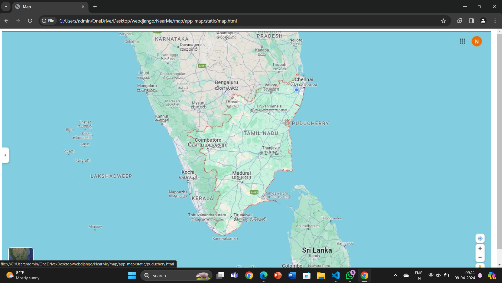
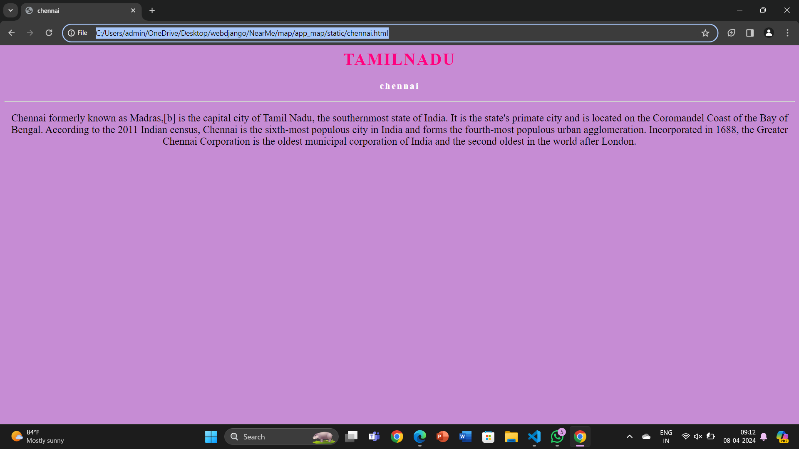
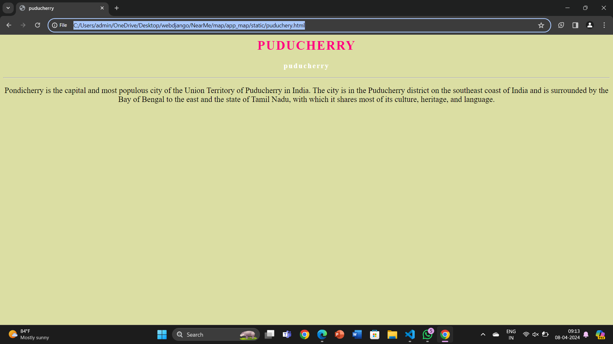
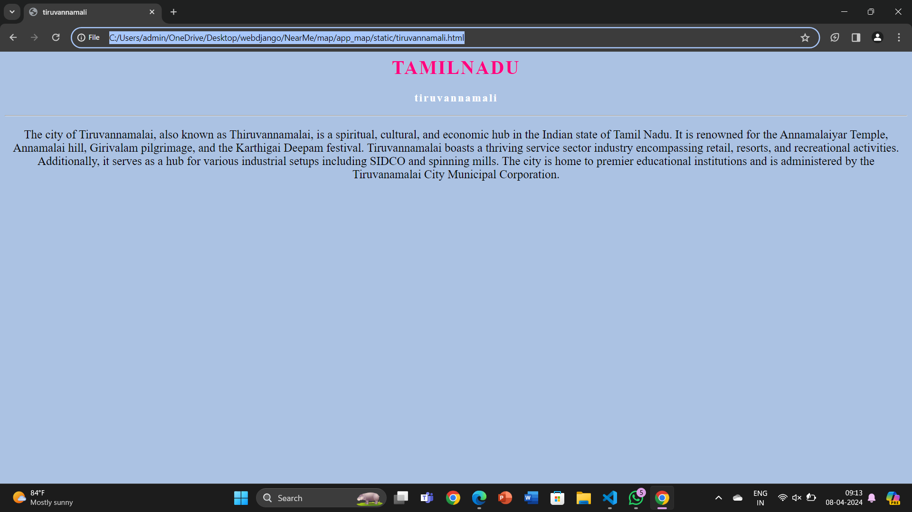
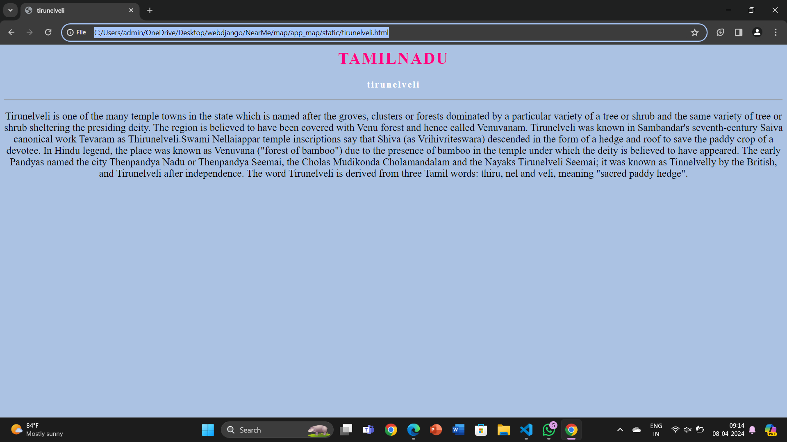
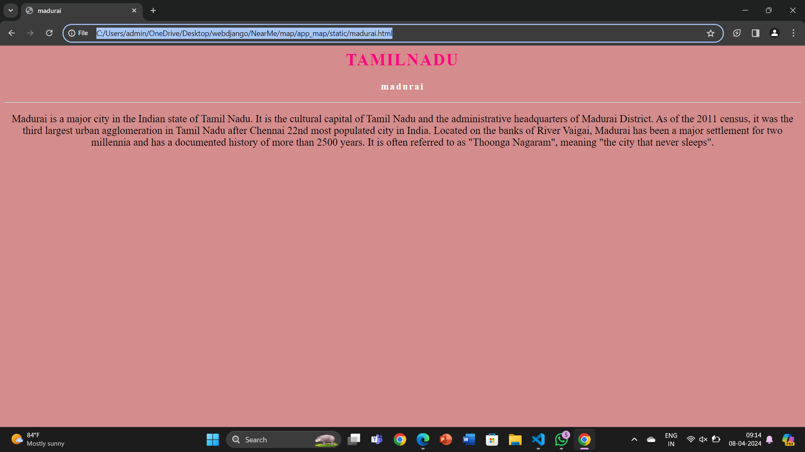

# Ex04 Places Around Me
## Date: 

## AIM
To develop a website to display details about the places around my house.

## DESIGN STEPS

### STEP 1
Create a Django admin interface.

### STEP 2
Download your city map from Google.

### STEP 3
Using ```<map>``` tag name the map.

### STEP 4
Create clickable regions in the image using ```<area>``` tag.

### STEP 5
Write HTML programs for all the regions identified.

### STEP 6
Execute the programs and publish them.

## CODE
```
# map.html
<!DOCTYPE html>
<html>
<head>
    <title>Map</title>
</head>
<body>
    
    <map name="workmap">
        <area shape="circle" coords="900,140,30" alt="Chennai" href="chennai.html">
        <area shape="circle" coords="800,220,30" alt="tiruvannamali" href="tiruvannamali.html">
        <area shape="circle" coords="850,300,30" alt="puduchery" href="puduchery.html">
        <area shape="circle" coords="720,430,30" alt="Madurai" href="madurai.html">
        <area shape="circle" coords="700,595,30" alt="tirunelveli" href="tirunelveli.html">
    </map>
</body>
</html>
```
```
# chennai.html
<html>
    <head>
        <title>chennai</title>
    </head>
    <body style="background-color: rgb(198, 140, 212);">
        <center>
            <h1 style="color: rgb(255, 0, 128);letter-spacing: 2px;">TAMILNADU </h1>
            <h3 style="color: white; letter-spacing: 2px;">chennai</h3>
            <hr>
            <p style="font-size: 20px;">Chennai formerly known as Madras,[b] is the capital city of Tamil Nadu, the southernmost state of India. It is the state's primate city and is located on the Coromandel Coast of the Bay of Bengal. According to the 2011 Indian census, Chennai is the sixth-most populous city in India and forms the fourth-most populous urban agglomeration. Incorporated in 1688, the Greater Chennai Corporation is the oldest municipal corporation of India and the second oldest in the world after London.</p>
        </center>
    </body>
</html>
```
```
# puducherry.html
<html>
    <head>
        <title>puducherry</title>
    </head>
    <body style="background-color: rgb(219, 222, 163);">
        <center>
            <h1 style="color: rgb(255, 0, 128);letter-spacing: 2px;">PUDUCHERRY</h1>
            <h3 style="color: white; letter-spacing: 2px;">puducherry</h3>
            <hr>
            <p style="font-size: 20px;">Pondicherry  is the capital and most populous city of the Union Territory of Puducherry in India. The city is in the Puducherry district on the southeast coast of India and is surrounded by the Bay of Bengal to the east and the state of Tamil Nadu, with which it shares most of its culture, heritage, and language.</p>
        </center>
    </body>
</html>
```
```
#tiruvannamalai.html

<html>
    <head>
        <title>tiruvannamali</title>
    </head>
    <body style="background-color: rgb(171, 194, 227);">
        <center>
            <h1 style="color: rgb(255, 0, 128);letter-spacing: 2px;">TAMILNADU</h1>
            <h3 style="color: white; letter-spacing: 2px;">tiruvannamali</h3>
            <hr>
            <p style="font-size: 20px;">The city of Tiruvannamalai, also known as Thiruvannamalai, is a spiritual, cultural, and economic hub in the Indian state of Tamil Nadu. It is renowned for the Annamalaiyar Temple, Annamalai hill, Girivalam pilgrimage, and the Karthigai Deepam festival. Tiruvannamalai boasts a thriving service sector industry encompassing retail, resorts, and recreational activities. Additionally, it serves as a hub for various industrial setups including SIDCO and spinning mills. The city is home to premier educational institutions and is administered by the Tiruvanamalai City Municipal Corporation.</p>
        </center>
    </body>
</html>
```
```
# tirunelveli.html
<html>
    <head>
        <title>tirunelveli</title>
    </head>
    <body style="background-color: rgb(171, 194, 227);">
        <center>
            <h1 style="color: rgb(255, 0, 128);letter-spacing: 2px;">TAMILNADU</h1>
            <h3 style="color: white; letter-spacing: 2px;">tirunelveli</h3>
            <hr>
            <p style="font-size: 20px;">Tirunelveli is one of the many temple towns in the state which is named after the groves, clusters or forests dominated by a particular variety of a tree or shrub and the same variety of tree or shrub sheltering the presiding deity. The region is believed to have been covered with Venu forest and hence called Venuvanam. Tirunelveli was known in Sambandar's seventh-century Saiva canonical work Tevaram as Thirunelveli.Swami Nellaiappar temple inscriptions say that Shiva (as Vrihivriteswara) descended in the form of a hedge and roof to save the paddy crop of a devotee. In Hindu legend, the place was known as Venuvana ("forest of bamboo") due to the presence of bamboo in the temple under which the deity is believed to have appeared. The early Pandyas named the city Thenpandya Nadu or Thenpandya Seemai, the Cholas Mudikonda Cholamandalam and the Nayaks Tirunelveli Seemai; it was known as Tinnelvelly by the British, and Tirunelveli after independence. The word Tirunelveli is derived from three Tamil words: thiru, nel and veli, meaning "sacred paddy hedge".</p>
        </center>
    </body>
</html>
```
```
# madurai.html
<html>
    <head>
        <title>madurai</title>
    </head>
    <body style="background-color: rgb(212, 140, 140);">
        <center>
            <h1 style="color: rgb(255, 0, 128);letter-spacing: 2px;">TAMILNADU</h1>
            <h3 style="color: white; letter-spacing: 2px;">madurai</h3>
            <hr>
            <p style="font-size: 20px;">Madurai is a major city in the Indian state of Tamil Nadu. It is the cultural capital of Tamil Nadu and the administrative headquarters of Madurai District. As of the 2011 census, it was the third largest urban agglomeration in Tamil Nadu after Chennai 22nd most populated city in India. Located on the banks of River Vaigai, Madurai has been a major settlement for two millennia and has a documented history of more than 2500 years. It is often referred to as "Thoonga Nagaram", meaning "the city that never sleeps".</p>
        </center>
    </body>
</html>
```

## OUTPUT








## RESULT
The program for implementing image maps using HTML is executed successfully.
